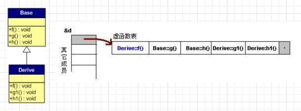

# c++常见问题

<!-- GFM-TOC -->
* [智能指针](#智能指针)
    * [unique_ptr](#unique_ptr)
    * [shared_ptr](#shared_ptr)
    * [weak_ptr](#weak_ptr)
* [构造函数和析构函数](#构造函数和析构函数)
    * [构造函数](#构造函数)
    * [析构函数](#析构函数)
* [虚函数](#虚函数)
* [对象大小计算](#对象大小计算)
<!-- GFM-TOC -->

## 智能指针
C++里面的四个智能指针，auto_ptr，unique_ptr，shared_ptr，weak_ptr，其中后三个是c++11支持，并且第一个已经被c++11弃用。因为智能指针是一个类，当超出了类的实例对象的作用域时，会自动调用对象的析构函数，析构函数会自动释放资源。所以智能指针的作用原理就是在函数结束时自动释放内存空间，不需要手动释放内存空间。

### unique_ptr
std::unique_ptr 是一种独占的智能指针，它禁止其他智能指针与其共享同一个对象，从而保证代码的安全。可以在异常时可以帮助避免资源泄漏。但unique_ptr提供了 move 操作，因此我们可以用std::move()来转移unique_ptr。
```c++
std::unique_ptr<int> pointer = std::make_unique<int>(10); // make_unique 从 C++14 引入
std::unique_ptr<int> pointer2 = pointer; // 非法
```


### shared_ptr
std::shared_ptr 是一种智能指针，它能够记录多少个 shared_ptr 共同指向一个对象，从而消除显式的调用 delete，当引用计数变为零的时候就会将对象自动删除。多个智能指针可以共享同一个对象，对象的最末一个拥有着有责任销毁对象，并清理与该对象相关的所有资源。


```c++
//创建
std::shared_ptr<int> p2(nullptr);
//初始化
std::shared_ptr<int> p3(new int(10));
std::shared_ptr.get()   //获取原始指针，
std::shared_ptr.reset() //减少一个引用计数， 
std::shared_ptr.use_count() //来查看一个对象的引用计数。

```

### weak_ptr
std::shared_ptr 依然存在着资源无法释放的问题。

```c++
struct A;
struct B;

struct A {
    std::shared_ptr<B> pointer;
    ~A() {
        std::cout << "A 被销毁" << std::endl;
    }
};
struct B {
    std::shared_ptr<A> pointer;
    ~B() {
        std::cout << "B 被销毁" << std::endl;
    }
};
int main() {
    auto a = std::make_shared<A>();
    auto b = std::make_shared<B>();
    a->pointer = b;
    b->pointer = a;
}

```
运行结果是 A, B 都不会被销毁，这是因为 a,b 内部的 pointer 同时又引用了 a,b，这使得 a,b 的引用计数均变为了 2，而离开作用域时，a,b 智能指针被析构，却只能造成这块区域的引用计数减一，这样就导致了 a,b 对象指向的内存区域引用计数不为零，而外部已经没有办法找到这块区域了，也就造成了内存泄露。

解决这个问题的办法就是使用弱引用指针 std::weak_ptr，std::weak_ptr是一种弱引用（相比较而言 std::shared_ptr 就是一种强引用）。弱引用不会引起引用计数增加。std::weak_ptr 没有 * 运算符和 -> 运算符，所以不能够对资源进行操作，它的唯一作用就是用于检查 std::shared_ptr 是否存在，其 expired() 方法能在资源未被释放时，会返回 false，否则返回 true。

## 构造函数和析构函数

### 构造函数 
类的构造函数是类的一种特殊的成员函数，它会在每次创建类的新对象时执行。**构造函数的名称与类的名称是完全相同**，并且不会返回任何类型，也不会返回 void。构造函数可用于为某些成员变量设置初始值。构造函数可以分为4类：

```c++
//（1）默认构造函数。
Student(）；//没有参数

//（2）初始化构造函数
Student(int num，int age）；//有参数

//（3）复制（拷贝）构造函数
Student(Student&）；//形参是本类对象的引用变量

//（4）转换构造函数
Student(int r) ；//形参是其他类型变量，且只有一个形参
```

**拷贝构造函**数默认为浅拷贝。浅拷贝是指当出现类的等号赋值时，它能够完成静态成员的值复制。当数据成员中没有指针时，浅拷贝是可行的。但当数据成员中有指针时，如果采用简单的浅拷贝，则两类中的指针将指向同一个地址，对象即将结束时，两个类会分别调用析构函数，导致指针悬挂现象。所以这时必须采用深拷贝，在堆内存中另外申请空间来储存数据，防止指针悬挂现象。

**构造函数不能是虚函数（因为在调用构造函数时，虚表指针并没有在对象的内存空间中，必须要构造函数调用完成后才会形成虚表指针**

### 析构函数
类的析构函数会在每次删除所创建的对象时执行。析构函数的名称与类的名称是完全相同的，只是在前面加了个波浪号（~）作为前缀，它不会返回任何值，也不能带有任何参数。析构函数有助于在跳出程序（比如关闭文件、释放内存等）前释放资源。

## 虚函数
C++中的虚函数的作用主要是实现了多态的机制。关于多态，简而言之就是用父类型别的指针指向其子类的实例，然后通过父类的指针调用实际子类的成员函数。这种技术可以让父类的指针有“多种形态”。

编译器必须生成能够在程序运行时选择正确的虚方法的代码,这被称为**动态联编**。当类中存在虚函数时，编译器默认会给对象添加一个**隐藏成员**。该成员为一个指向**虚函数表(virtual function table,vtbl)的指针**。

虚函数表是一个保存了虚函数地址的数组。编译器会检查类中所有的虚函数，依次将每个虚函数的地址，存入虚函数表。虚函数表主是要一个类的虚函数的地址表，这张表解决了继承、覆盖的问题，保证其容真实反应实际的函数。这样，在有虚函数的类的实例中这个表被分配在了这个实例的内存中，所以，当我们用父类的指针来操作一个子类的时候，这张虚函数表就显得由为重要了，它就像一个地图一样，指明了实际所应该调用的函数。




* 析构函数可以是虚函数，因为**多态**子类可以有自己构造的变量。
* 构造函数不能是虚函数：
    * 虚函数通过虚函数表来实现，一个对象未初始化时不存在虚函数表
    * delphi支持构造函数是虚函数[参考链接](https://www.zhihu.com/question/35632207)

## 对象大小计算
* 一个空对象的大小为1，c++规定，为了区分不同的对象。
```c++
#include <iostream>

class A{};

int main() {
    A a;
    std::cout << sizeof(a) << std::endl;//输出1
    std::cout << sizeof(A) << std::endl;//输出1

    A* a1 = new A;
    A* a2 = new A;
    //理论上a1 != a2 
    return 0;
}
```

* 一个空对象加一个空的虚析构函数，大小为虚函数指针长度8（**需要指针指向虚函数表**）

* 对象大小不包括**静态变量**的大小

* 对象大小需要考虑字节对齐

* 成员函数不占用对象空间，编译后函数与对象是分离的以便节约空间；其中静态遍历在堆区，成员变量在栈区，成员函数在代码区

## new关键字
C++中使用new运算符产生一个存在于Heap（堆）上对象时，实际上调用了operator new()函数和placement new()函数。在使用new创建堆对象时，new有三种面貌，分别是：new operator、operator new()和placement new()。

### new operator
new operator是C++保留的关键字，我们无法改变其含义。在使用运算符new时，其最终是通过调用operator new()和placement new()来完成堆对象的创建工作。使用new operator时，其完成的工作有如下三步： 
1. 分配内存空间
2. 初始化内存
3. 返回内存地址

### operator new()
operator new()用于申请Heap空间，功能类似于C语言的库函数malloc()，尝试从堆上获取一段内存空间，如果成功则直接返回，如果失败则转而去调用一个new handler，然后抛出一个bad_alloc异常。operator new()的函数原型一般为：
```c++
void* operator new (std::size_t size) throw (std::bad_alloc);

void *__CRTDECL operator new(size_t size) throw (std::bad_alloc)
{       
    // try to allocate size bytes
    void *p;
    while ((p = malloc(size)) == 0)      //申请空间
        if (_callnewh(size) == 0)        //若申请失败则调用处理函数
        {       
            // report no memory
            static const std::bad_alloc nomem;
            _RAISE(nomem);               //#define _RAISE(x) ::std:: _Throw(x) 抛出nomem的异常
        }
    return (p);
}
```

1. 函数后添加throw表示可能会抛出throw后括号内的异常； 
2. operator new()分为全局和类成员。
    1. 当为类成员函数时，使用new产生类对象时调用的则是其成员函数operator new()。
    2. 如果要重载全局的operator new会改变所有默认的operator new的方式，所以必须要注意。
    3. 正如new与delete相互对应，operator new与operator delete也是一一对应，如果重载了operator new，那么理应重载operator delete。

### placement new()
一般来说，使用new申请空间时，是从系统的堆中分配空间，申请所得空间的位置根据当时内存实际使用情况决定。但是，在某些特殊情况下，可能需要在程序员指定的特定内存创建对象，这就是所谓的“定位放置new”（placement new）操作。
placement new()是一个特殊的operator new()，因为其**是operator new()函数的重载版本**，只是取了个别名叫作placement new罢了。作用是在已经获得的堆空间上调用类构造函数来初始化对象，也就是定位构造对象。

## 参考链接

* [现代c++教程](https://changkun.de/modern-cpp/zh-cn/05-pointers/index.html#5-4-std-weak-ptr)
* [huihut的c++面经](https://github.com/huihut/interview)